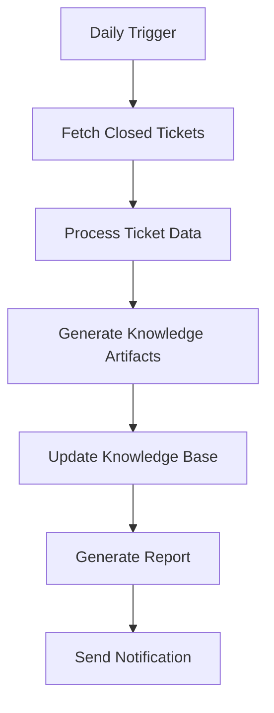
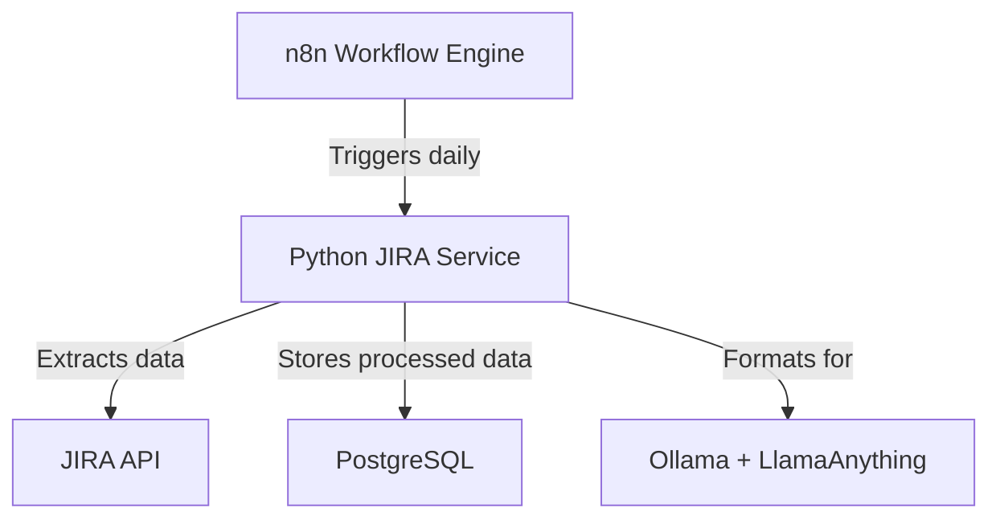

# JIRA Knowledge Pipeline

## Overview
The JIRA Knowledge Pipeline is an automated system designed to extract valuable insights from closed JIRA tickets, process their content into structured knowledge, and feed this information into the Ollama + LlamaAnything knowledge base. This pipeline will run daily to ensure the knowledge base remains current and valuable for team members.

## Objectives
1. Automate the extraction of knowledge from closed JIRA tickets
2. Process and structure ticket data into meaningful insights
3. Seamlessly integrate with the existing Ollama + LlamaAnything knowledge base
4. Provide searchable, organized knowledge for better team productivity
5. Reduce knowledge silos and improve information discovery

## Functional Requirements

### 1. JIRA Integration
- Connect to JIRA Cloud/REST API
- Authenticate securely using API tokens
- Query closed tickets based on configurable filters
- Handle pagination for large result sets

### 2. Data Processing
- Extract relevant fields (title, description, comments, labels, etc.)
- Clean and preprocess text data
- Generate contextual summaries of ticket content
- Identify and extract key technical terms and concepts
- Categorize tickets based on content and metadata

### 3. Knowledge Base Integration
- Format processed data for Ollama + LlamaAnything
- Handle API authentication and rate limiting
- Support incremental updates to the knowledge base
- Maintain data consistency and avoid duplicates

### 4. Monitoring and Logging
- Track pipeline execution status
- Log errors and warnings for troubleshooting
- Monitor data quality metrics
- Generate summary reports of processed items

## Non-Functional Requirements

### 1. Performance
- Process up to 10,000 tickets per day
- Complete daily run within 2-hour window
- Handle API rate limits gracefully

### 2. Reliability
- Implement retry mechanisms for failed operations
- Maintain idempotency of operations
- Handle network interruptions gracefully

### 3. Security
- Secure storage of API credentials
- Follow principle of least privilege for API access
- Encrypt sensitive data at rest and in transit

## Pipeline Architecture

## Data Flow
1. **Extraction**: Pull closed tickets from JIRA API
2. **Transformation**: Convert raw ticket data into structured knowledge
3. **Enrichment**: Add metadata and context
4. **Storage**: Update knowledge base with new information
5. **Verification**: Validate successful processing

## Success Metrics
- Number of tickets processed per run
- Processing time per ticket
- Knowledge base update success rate
- Reduction in duplicate ticket creation
- User engagement with knowledge base

## Future Enhancements
- Natural language query interface
- Automated tagging and categorization
- Sentiment analysis on ticket comments
- Integration with additional data sources
- Advanced analytics and insights dashboard

## Dependencies
- JIRA Cloud/REST API access
- Ollama + LlamaAnything knowledge base
- Python 3.8+
- Required Python packages (to be defined)

## Timeline
- [ ] Phase 1: Setup and JIRA Integration (2 weeks)
- [ ] Phase 2: Data Processing Pipeline (3 weeks)
- [ ] Phase 3: Knowledge Base Integration (2 weeks)
- [ ] Phase 4: Testing and Optimization (2 weeks)
- [ ] Phase 5: Deployment and Monitoring (1 week)

## Risks and Mitigations
- **API Rate Limiting**: Implement exponential backoff and retry logic
- **Data Quality**: Add validation steps and manual review for edge cases
- **Integration Issues**: Maintain comprehensive logging and monitoring
- **Performance Bottlenecks**: Design for horizontal scaling if needed

## Implementation Details

### Architecture Overview
The implementation uses a Docker Compose setup with three main services:
1. **n8n** - Workflow automation engine
2. **Python JIRA Service** - Custom service for JIRA API integration
3. **PostgreSQL** - Database for storing processed ticket data

### Docker Compose Setup
The system is containerized using Docker Compose with the following services:

1. **n8n Service**
   - Uses official n8n Docker image
   - Provides web-based workflow editor
   - Scheduled to run daily extraction workflow
   - Exposes port 5678 for web interface

2. **Python JIRA Service**
   - Custom Python application
   - Provides REST API endpoints for JIRA data extraction
   - Processes and summarizes ticket content
   - Formats data for knowledge base integration

3. **PostgreSQL Database**
   - Stores processed ticket data
   - Enables data persistence between runs
   - Supports incremental updates

### n8n Workflow
The n8n workflow orchestrates the entire process:
1. Triggers daily at a scheduled time
2. Calls the Python service to extract closed JIRA tickets
3. Processes the extraction results
4. Exports formatted data for knowledge base integration
5. Generates execution reports

### Python JIRA Integration
The Python service handles the core functionality:
1. Connects to JIRA API using secure authentication
2. Extracts closed tickets from the past day
3. Processes ticket content and generates contextual summaries
4. Stores processed data in PostgreSQL
5. Formats data for Ollama + LlamaAnything knowledge base

### Deployment Instructions
1. Clone the repository
2. Copy `.env.example` to `.env` and configure environment variables
3. Run `docker-compose up -d` to start all services
4. Access n8n at `http://localhost:5678` to import and activate workflows
5. Monitor logs with `docker-compose logs -f`